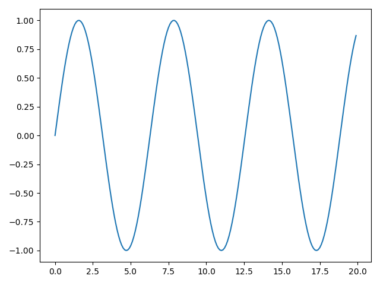

# 00-01 파이썬 기초

## 1. 파이썬이란?

문법이 간단하고 배우기 쉬운 프로그래밍 언어.
AI/ML 생태계가 잘 갖춰져 있어서 사실상 표준으로 쓰임.

> 이 자료에서 사용할 언어
> ...파이썬 문법은 생략


## 2. AI에서 주로 쓰는 라이브러리

- **NumPy** - 행렬/벡터 연산 (신경망 계산의 기반)
- **Matplotlib** - 데이터 시각화


## 3. Numpy

행렬 계산을 도와주는 python 라이브러리.

```py
import numpy as np
```

AI학습에서 대량의 데이터를 쉽게 다루기 위해 행렬을 이용한 계산을 자주 사용한다.

## 4. Matplotlib

그래프를 그려주는 라이브러리.

```py
import matplotlib.pyplot as plt
```

딥러닝에서 데이터 시각화를 위해 그래프를 그리기 위해 사용된다.

### 예제

sin함수 그리기

```py
import matplotlib.pyplot as plt
import numpy as np

x = np.arange(0, 20, 0.1)
y = np.sin(x)

plt.plot(x, y)
plt.show()
```


