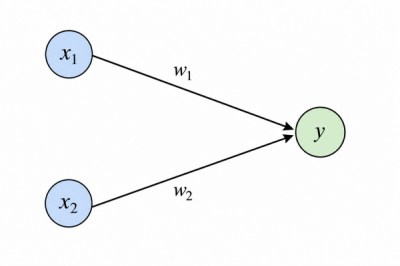

# 01 퍼셉트론 (perceptron)

## 1. 퍼셉트론이란?

* 신경망(딥러닝)의 기초가 되는 알고리즘.
* 다수의 신호를 입력 받아서, 하나의 신호로 출력함.

+추가(클릭하기)

* 퍼셉트론은 1957년 프랭크 로젠블랫(Frank Rosenblatt)에 의해 고안되었다.
* 신호는 흐른다(1)와 안 흐른다(0)로 구분한다.

---

* 그림은 퍼셉트론 그림이다.
* x는 입력 신호, y는 출력 신호이다. (그림과 다르게 입력 신호는 여러개가 될 수 있다.)
* 그림의 원을 뉴런 혹은 노드라고 한다.

수학식으로 나타내면,

$$
y =
\begin{cases}
0 & (w_1x_1 + w_2x_2 \le \theta) \\
1 & (w_1x_1 + w_2x_2 > \theta)
\end{cases}
$$

| 기호 | 의미 |
|--|--|
| $x_1$ | 첫번째 입력값 |
| $x_2$ | 두번째 입력값 |
| $w_1$ | $x_1$의 가중치 |
| $w_2$ | $x_2$의 가중치 |
| $\theta$ | 임계값 |
| $y$ | 출력값 |

* $\theta$(임계값)는 이 퍼셉트론을 활성화하기 위해서 넘어야 하는 값이다. -> 계산 후 $\theta$보다 크면 1, 작거나 같으면 0
* $w_1$과 $w_2$(가중치)는 각각의 입력 값, $x_1$와 $x_2$의 중요도를 나타낸다. -> 가중치가 클수록 그 입력값이 얼마나 중요한지를 나타낸다.
* 임계값과 가중치를 매개변수라고 하기도 한다.

---

[돌아가기(README)](../README.md)

[이전(python)](00-01python.md)

[다음(gate)](01-02gate.md)
