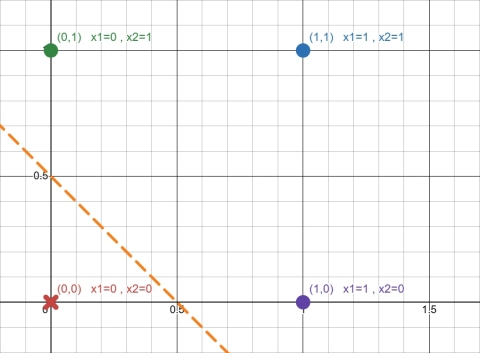
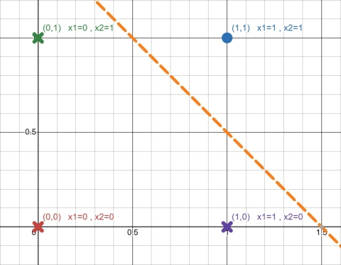

# 01 퍼셉트론 (perceptron)

## 4. XOR 문제: 단층 퍼셉트론의 한계

퍼셉트론으로는 XOR게이트를 구현할 수 없다.

> 정확히는 "단층" 퍼셉트론으로는 구현할 수 없다.

### 시각화

#### AND게이트

#### OR게이트

방금 살펴본 OR게이트와 AND게이트를 시각화한 것이다.

1. 두 입력을 ($x_1$,$x_2$)으로 나타내어, 해당하는 위치에 점을 찍는다.

2. 점을 출력 결과가 0이면 X로, 1이면 O로 표시한다.

3. 점 X와 점 O의 부분을 직선 하나로 나눈다.

AND게이트와 OR게이트는 점 X와 점 O의 부분을 직선 하나로 나눌 수 있다.

하나의 직선으로 나누는 이유

0또는 1로 나누는 기준은 내부의 값이 0이 되는 순간이다.

$$
w_1x_1 + w_2x_2 + b = 0
$$

위의 식에서 우리가 그래프로 표현할 축인 $x_2$를 기준으로 식을 정리하면,

$$
x_2 = \left(-\frac{w_1}{w_2}\right)x_1 + \left(-\frac{b}{w_2}\right)
\quad (w_2 \neq 0)
$$

꼴이 된다.  
이 식은 1차 함수 방정식 $y = ax + b$의 형태이다.  
즉, 단층 퍼셉트론은 일직선 그래프이다.

---

> $w_2 \neq 0$인 이유  

$w_2 = 0$이어도 여전히 직선이다.

만약 $w_2 = 0$이라면, 

$$
x_1 = \left(-\frac{w_2}{w_1}\right)x_2 + \left(-\frac{b}{w_1}\right)
\quad (w_1 \neq 0)
$$

으로 $x_1$을 기준으로 식을 정리할 수 있기 때문이다.

---

> $w_1 \neq 0$또는 $w_2 \neq 0$인 이유  

만약 두 가중치가 모두 0이면 $(x_1, x_2)$과 상관없이 조건이 오직 편향$(b)$에 의해서만 결정되는 상태가 된다.

$$
w_1x_1 + w_2x_2 + b = 0
$$

이 내부식에서 만약 모든 가중치가 0이라면, 내부식이 

$$
0x_1 + 0x_2 + b = 0
\rightarrow
b = 0
$$

이다. 
 
다시 말해서, 변수 $x_1$과 $x_2$가 존재하지 않아서 `선 자체가 사라지고,`  
$x_1$, $x_2$가 무엇이든 상관없이 오직 b에 의해 값이 변해서 `모든 데이터가 한가지로만 분류되며,`  
입력값과 가중치를 바탕으로 오차를 계산 할 수 없어서 `학습이 불가능하다.`

 

#### XOR게이트

하지만 XOR게이트는 오직 직선 하나만으로는 표현할 수 없다.

---

[돌아가기(README)](../README.md)

[이전(python구현)](01-03python구현.md)

[다음(MLP)](01-05MLP.md)