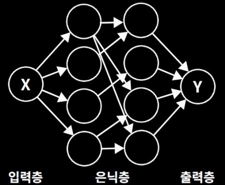

# 01 퍼셉트론 (perceptron)

## 5. MLP

직선 하나만으로 표현할 수 없으면...  
직선 두개를 쓰자!  

다층 퍼셉트론(MLP)는 지금까지 배운 단층 퍼셉트론을 여러층으로 쌓아 올린 형태이다.

SLP? MLP? (클릭)

`SLP`는 `Single-Layer-Perceptron`로 단층 퍼셉트론이다.  
`MLP`는 `Multi-Layer-Perceptron`로 다층 퍼셉트론이다.

### 다층 퍼셉트론

다층 퍼셉트론은 입력층, 은닉층, 출력층으로 구성되어있다.

| 특징 | 입력층 | 은닉층 | 출력층 |
|--|--|--|--|
| 역할 | 외부의 데이터를 받는 층 | 연산을 하는 층 | 최종 연산을 내보내는 층 |

은닉층을 자세히 설명하자면, 

1. 은닉층은 `여러개의 SLP를 겹친` 만든 구조이다.

2. `하나 이상의 층`을 이루며, 층이 여러 층일수록 더 복잡한 패턴을 학습할 수 있다.

3. 직선인 SLP를 겹쳐서, `여러 곡선이나 비선형의 형태를 표현`할 수 있다.

4. XOR같은 SLP로 `구현하기 힘든 구조도 표현`할 수 있게 합니다.

### XOR표현

XOR은 NAND와 OR게이트만으로 만들 수 있다.

---

[돌아가기(README)](../README.md)

[이전(한계)](01-04한계.md)

[다음(ANN)](02-00ANN.md)