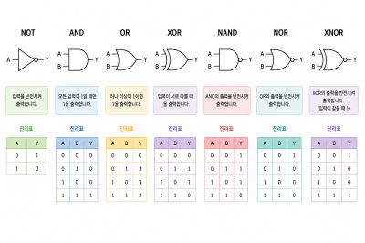

# 게이트

진리표: 입력 신호와 출력 신호를 쓴 대응 표.

## 1. NOT게이트

진리표

| A | 출력 |
|--|--|
| 0 | 1 |
| 1 | 0 |

출력 반전.

## 2. AND게이트

진리표

| A | B | 출력 |
|--|--|--|
| 0 | 0 | 0 |
| 0 | 1 | 0 |
| 1 | 0 | 0 |
| 1 | 1 | 1 |

모든 입력이 1일때만 1출력

## 3. OR게이트

| A | B | 출력 |
|--|--|--|
| 0 | 0 | 0 |
| 0 | 1 | 1 |
| 1 | 0 | 1 |
| 1 | 1 | 1 |

하나 이상이 1이면 1출력.

## 4. XOR게이트

| A | B | 출력 |
|--|--|--|
| 0 | 0 | 0 |
| 0 | 1 | 1 |
| 1 | 0 | 1 |
| 1 | 1 | 0 |

입력값이 서로 다를 때 1출력.

## 5. 기타

NOT과 다른 게이트를 합쳐서 부르기도 한다.

* NOT + AND -> NAND
* NOT + OR -> NOR
* NOT + XOR -> XNOR

NOT이 붙여진 게이트들은 원래 출력값을 반대로 하여 출력된다.

## 6. 정리

게이트 그림들은 그 게이트의 논리 기호이다.

---

[돌아가기(퍼셉트론)](perceptron.md)
